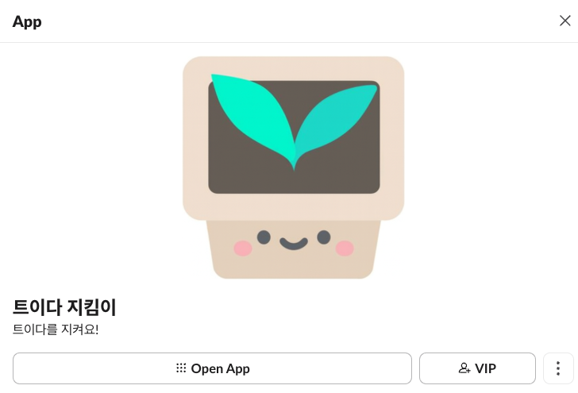

# TEUIDA Jikimi



Slack과 Jira를 연동하여 이슈 관리를 자동화하는 지능형 플랫폼

> 2026.01.25 이후로 [트이다 Repository](https://github.com/teuida-dev-team/teuida-jikimi) 에서 관리 됩니다.


---

## 소개

**Jikimi(지킴이)**는 Slack 슬래시 커맨드를 통해 이슈를 생성하고, Jira와 자동으로 동기화하며, OpenAI 임베딩을 활용하여 유사 이슈를 검색하는 통합 이슈 관리 시스템입니다.

팀원들이 Slack에서 벗어나지 않고도 이슈를 생성, 할당, 해결할 수 있으며, 모든 이슈는 Jira와 실시간으로 동기화됩니다.


---

## 주요 기능

### Slack 통합

- `/issue` 슬래시 커맨드로 이슈 생성 모달 호출
    - 이슈 할당 및 상태 변경
- `/issue-stats` 이슈 통계 대시보드 조회
    - 슬랙 메시지 응답 3초 정책으로 비동기 처리

### Jira 연동

- 이슈 생성 시 Jira 티켓 자동 생성
- 양방향 상태 동기화

### AI 유사 이슈 검색

- 이슈 생성시 OpenAI Embeddings API를 활용한 벡터 유사도 검색
- 0.75 유사도 임계값 기반 중복 이슈 탐지
- 관련 이슈 추천

### 캐싱

- Caffeine 캐시를 통한 응답 성능 최적화

---

## 아키텍처

```
┌─────────────────────────────────────────────────────────────────┐
│                         Slack Workspace                         │
│                                                                 │
│   User ──▶ /issue ──▶ Slash Command ──▶ Modal ──▶ Submit        │
└───────────────────────────────┬─────────────────────────────────┘
                                │
                                ▼
┌─────────────────────────────────────────────────────────────────┐
│                        Jikimi Backend                           │
│  ┌──────────────┐  ┌──────────────┐  ┌──────────────────────┐   │
│  │ Slack Bolt   │  │ Issue        │  │ Similarity Search    │   │
│  │ Handler      │──│ Service      │──│ (OpenAI Embeddings)  │   │
│  └──────────────┘  └──────────────┘  └──────────────────────┘   │
│         │                  │                    │               │
│         │                  ▼                    │               │
│         │          ┌──────────────┐             │               │
│         │          │ MariaDB      │◀────────────┘               │
│         │          │ (Issues)     │                             │
│         │          └──────────────┘                             │
│         │                                                       │
│         ▼                                                       │
│  ┌──────────────┐                                               │
│  │ Jira Client  │──▶ Jira Cloud API                             │
│  └──────────────┘                                               │
└─────────────────────────────────────────────────────────────────┘
```

### 기술 스택

| 구분          | 기술                          |
|-------------|-----------------------------|
| Language    | Java 25                     |
| Framework   | Spring Boot 4.0.1           |
| Database    | MariaDB, H2 (테스트)           |
| ORM         | JPA, QueryDSL 5.1.0         |
| Cache       | Caffeine                    |
| Slack SDK   | Bolt Jakarta Servlet 1.45.3 |
| HTTP Client | Spring Cloud OpenFeign      |
| Build       | Gradle                      |

---

## 시작하기

### 요구사항

- Java 25
- MariaDB 10.x 이상
- Slack App (Bot Token, Signing Secret)
- Jira Cloud 계정 (API Token)
- OpenAI API Key

### 환경변수 설정

`application-slack.yml`:

```yaml
slack:
  signing-secret: ${SLACK_SIGNING_SECRET}
  bot-token: ${SLACK_BOT_TOKEN}
  workspace-url: https://your-workspace.slack.com
```

`application-jira.yml`:

```yaml
jira:
  token: ${JIRA_API_TOKEN}
  email: ${JIRA_EMAIL}
  url: https://your-domain.atlassian.net
  project-key: YOUR_PROJECT_KEY
  issue-type-id: 10011
```

`application-open-ai.yml`:

```yaml
open-ai:
  url: https://api.openai.com
  token: ${OPENAI_API_KEY}
```

### 실행

```bash
# 개발 환경
./gradlew bootRun --args='--spring.profiles.active=local'

# 빌드
./gradlew build

# JAR 실행
java -jar build/libs/jikimi-0.0.1-SNAPSHOT.jar --spring.profiles.active=prod
```

---

## 프로젝트 구조

```
src/main/java/com/teuida/jikimi/
├── common/                    # 공통 설정 및 유틸리티
│   ├── config/                # 애플리케이션 설정
│   ├── enums/                 # 공통 Enum
│   ├── annotation/            # 커스텀 어노테이션
│   ├── aspect/                # AOP 관련
│   └── validation/            # 유효성 검증
│
├── domain/                    # 도메인 레이어
│   ├── config/                # 도메인 설정
│   ├── issue/                 # 이슈 도메인
│   │   ├── entity/            # JPA 엔티티
│   │   ├── repository/        # Repository
│   │   ├── service/           # 비즈니스 로직
│   │   └── model/             # 도메인 모델
│   └── exception/             # 도메인 예외
│
├── slack/                     # Slack 통합 모듈
│   ├── config/                # Slack 설정
│   ├── issue/                 # 이슈 관련 핸들러
│   │   ├── handler/           # 슬래시 커맨드/모달 핸들러
│   │   ├── parser/            # 요청 파서
│   │   ├── service/           # Slack 이슈 서비스
│   │   └── dto/               # DTO
│   ├── service/               # Slack 공통 서비스
│   ├── aspect/                # Slack AOP
│   ├── util/                  # 유틸리티
│   └── exception/             # Slack 예외
│
├── jira/                      # Jira 통합 모듈
│   ├── config/                # Jira 설정
│   ├── client/                # Jira REST API 클라이언트
│   │   └── dto/               # 요청/응답 DTO
│   └── service/               # Jira 서비스
│
└── openai/                    # OpenAI 통합 모듈
    ├── config/                # OpenAI 설정
    └── client/                # OpenAI API 클라이언트
        └── dto/               # 요청/응답 DTO
```

---

## 환경 설정

### Profiles

| Profile | 설명               |
|---------|------------------|
| `local` | 로컬 개발 환경 (H2 DB) |
| `dev`   | 개발 서버 환경         |
| `prod`  | 프로덕션 환경          |

### 주요 환경변수

| 변수명                    | 설명                              | 필수       |
|------------------------|---------------------------------|----------|
| `SLACK_SIGNING_SECRET` | Slack App Signing Secret        | O        |
| `SLACK_BOT_TOKEN`      | Slack Bot OAuth Token (`xoxb-`) | O        |
| `JIRA_API_TOKEN`       | Jira API Token                  | O        |
| `JIRA_EMAIL`           | Jira 계정 이메일                     | O        |
| `OPENAI_API_KEY`       | OpenAI API Key                  | O        |
| `DB_URL`               | MariaDB 접속 URL                  | O (prod) |
| `DB_USERNAME`          | DB 사용자명                         | O (prod) |
| `DB_PASSWORD`          | DB 비밀번호                         | O (prod) |

---

## 워크플로우

### 이슈 생성 플로우

```
1. Slack에서 /issue 명령어 입력
        │
        ▼
2. 이슈 생성 모달 표시
   - 제목, 설명, 우선순위 입력
        │
        ▼
3. 유사 이슈 검색 (OpenAI Embeddings)
   - 유사도 0.75 이상 이슈 표시
   - 중복 여부 확인
        │
        ▼
4. 이슈 저장 (DB)
        │
        ▼
5. Jira 티켓 자동 생성
        │
        ▼
6. Slack 채널에 생성 완료 메시지 전송
```

### 이슈 상태 관리

```
┌──────────┐    할당     ┌───────────┐    해결     ┌──────────┐
│   OPEN   │ ─────────▶ │ ASSIGNED  │ ─────────▶ │ RESOLVED │
└──────────┘            └───────────┘            └──────────┘
      │                       │                        │
      │                       │                        │
      └───────────────────────┴────────────────────────┘
                              │
                              ▼
                        ┌──────────┐
                        │  CLOSED  │
                        └──────────┘
```

---

## 라이선스

이 프로젝트는 내부 사용 목적으로 개발되었습니다.
